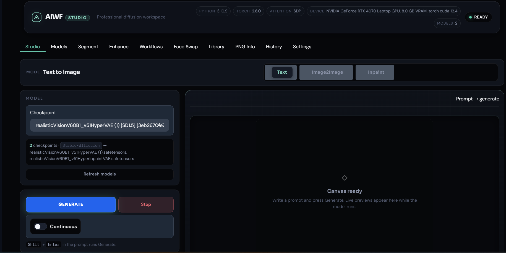
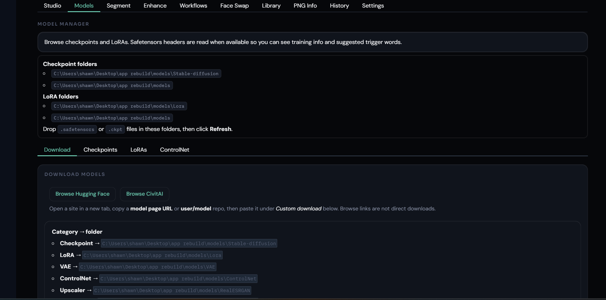

<p align="center">
  
</p>

# AIWF Studio

**AIWF Studio is an early public build of a local-first Stable Diffusion workspace.**

The project is a clean-room, AUTOMATIC1111-style WebUI rebuild with a different internal goal: keep the app easier to understand, maintain, test, and extend as it grows.

AIWF Studio is **not a full replacement for AUTOMATIC1111, Forge, or ComfyUI yet**. Those projects have years of maturity, extension support, edge-case handling, and community testing behind them. This repo is the foundation: a modernized workspace with clearer boundaries, a professional UI direction, and room for contributors to help shape the next steps.

<p align="center">
  
</p>

## Why this exists

Classic local diffusion tools made Stable Diffusion accessible to a huge number of people. They also grew fast, which naturally led to older patterns, broad shared state, tight coupling, and difficult-to-follow extension paths.

AIWF Studio explores a cleaner direction:

- UI actions route through services instead of directly into model/runtime internals.
- Requests and settings use typed models instead of loose ad-hoc dictionaries.
- Runtime folders are repo-local by default so setup is predictable.
- Features are grouped into clearer tabs and service layers.
- Compatibility ideas are welcome, but the goal is not to recreate legacy internals.

In plain terms: **familiar local diffusion workflow, cleaner architecture.**

## Current status

This is an **early public release candidate**.

What works today is meant to prove the foundation and user experience direction. Some areas are still experimental, especially workflow authoring and broader extension/plugin behavior.

Expect rough edges. Please open issues when something breaks, feels confusing, or needs clearer documentation.

## Screenshots

### Studio workspace

The Studio tab is the main generation workspace for text-to-image, image-to-image, and inpaint flows.

<p align="center">
  
</p>

### Model manager

The Models tab provides a cleaner model-management surface for checkpoints, LoRAs, ControlNet assets, and downloads.

<p align="center">
  
</p>

## Current feature set

### Studio

- Text-to-image, image-to-image, and inpaint workflow surface
- Live preview, continuous generation, and interrupt controls
- Hires fix, CFG, steps, sampler, clip skip, and VAE selection
- Tags, PNG metadata, seed reuse, and before/after comparison
- Dynamic prompts, wildcards, prompt files, and Compel support
- Style presets with editable templates
- Single-unit ControlNet support in Studio Advanced
- SAM-assisted masking for inpaint
- ReActor-style face swap on generated results

### Extra tabs

- Models
- Segment
- Enhance
- Workflows
- Face Swap
- Library
- PNG Info
- History
- Settings

### API

- Native `/api/v1`
- Early A1111-style `/sdapi/v1` adapter

The A1111-style API work is meant to improve compatibility where practical. It should not be treated as complete parity yet.

## Quick start

From the repo folder:

```bat
webui-user.bat
```

Or:

```powershell
python launch.py
```

By default, AIWF Studio uses local runtime folders inside this repo:

```text
models/
outputs/
prompts/
wildcards/
workflows/
```

Recommended model locations:

```text
models/Stable-diffusion/   # checkpoints
models/Lora/               # LoRAs
models/VAE/                # VAEs
```

## Requirements

AIWF Studio targets the modern Python/PyTorch diffusion stack.

```text
Python >=3.10,<3.13
PyTorch / CUDA build appropriate for your GPU
Gradio
Diffusers-related runtime dependencies
```

Python and CUDA compatibility matter. If something fails during install or model loading, include your Python version, Torch version, CUDA version, GPU, and launch command when opening an issue.

## Remote access and security

AIWF Studio includes Tailscale-aware connection info in Settings. Tailscale is the recommended path for routine phone/tablet access because it avoids broadly exposing the app.

Security guidance:

- `--listen` makes the UI reachable from other devices on your network.
- Add `username:password` auth before using remote access outside a trusted local setup.
- Treat Gradio public share links as convenience tools, not private tunnels.
- Prefer Tailscale for routine private remote access.

## Testing

The public repo includes tests for core behavior, wiring, and public-safe functionality.

Run:

```powershell
python -m pytest tests/ -q
```

Some heavier model/runtime tests may require the correct local diffusion environment, CUDA stack, and model files. If a test depends on large local assets or private machine paths, it should not be committed to the public repo.

## Workflows status

The Workflows tab is useful but still experimental. It should be treated as a work-in-progress until it gets deeper validation, better documentation, and broader real-world testing.

## Roadmap

Near-term priorities:

- Improve public documentation and setup guidance
- Add/expand CI where practical
- Harden txt2img, img2img, and inpaint smoke tests
- Improve model manager behavior and download handling
- Continue A1111-style API compatibility work
- Define a safer plugin/extension contract
- Mature workflow authoring
- Improve contributor onboarding

Longer-term ideas:

- Training tools
- Extension management
- Broader theme and workspace customization
- More complete workflow authoring
- Better model metadata and trigger-word handling
- More compatibility adapters where they make sense

## Contributing

Contributions are welcome.

Good first contributions include:

- Bug reports with clear reproduction steps
- Install fixes and documentation improvements
- UI polish
- Tests
- Model-path handling improvements
- API compatibility notes
- Small, focused pull requests

Please keep pull requests narrow when possible. This project is trying to stay maintainable, so a small understandable change is usually better than a huge all-in-one rewrite.

When opening an issue, include:

```text
OS:
Python version:
Torch version:
CUDA version:
GPU:
Launch command:
What you expected:
What happened:
Relevant console output:
```

## Clean-room rule

AIWF Studio is clean-room code. It can study behavior, public documentation, and compatibility expectations, but it should not copy incompatible source or recreate legacy internals wholesale.

Allowed:

- Studying behavior
- Reading public documentation
- Reimplementing compatible ideas
- Building adapters around public API expectations

Not allowed:

- Copying incompatible source
- Importing abandoned plugin code wholesale
- Recreating legacy global-state architecture just because it is familiar
- Adding code without clear attribution when attribution is needed

## Credits and thanks

AIWF Studio exists in conversation with the wider local-image community. Credit where it is due: the ecosystem exists because many people built tools, research projects, extensions, models, and documentation before this repo existed.

Related projects and references:

- [AUTOMATIC1111 / stable-diffusion-webui](https://github.com/AUTOMATIC1111/stable-diffusion-webui)
- [ControlNet](https://github.com/lllyasviel/ControlNet)
- [sd-webui-controlnet](https://github.com/Mikubill/sd-webui-controlnet)
- [ReActor](https://github.com/Gourieff/sd-webui-reactor)
- [Segment Anything](https://github.com/facebookresearch/segment-anything)
- [Grounding DINO](https://github.com/IDEA-Research/GroundingDINO)
- [Diffusers](https://github.com/huggingface/diffusers)
- [GFPGAN](https://github.com/TencentARC/GFPGAN)
- [CodeFormer](https://github.com/sczhou/CodeFormer)
- [Real-ESRGAN](https://github.com/xinntao/Real-ESRGAN)

See [docs/ATTRIBUTION.md](docs/ATTRIBUTION.md) for the fuller attribution trail.

## Repo notes

These should stay local and out of public Git history:

- `venv/`
- `models/`
- `outputs/`
- machine-specific config files
- private model files
- local logs
- local agent/session files
