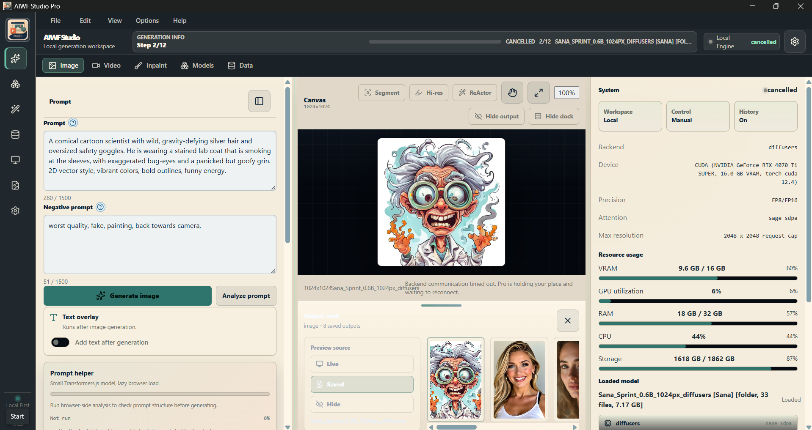
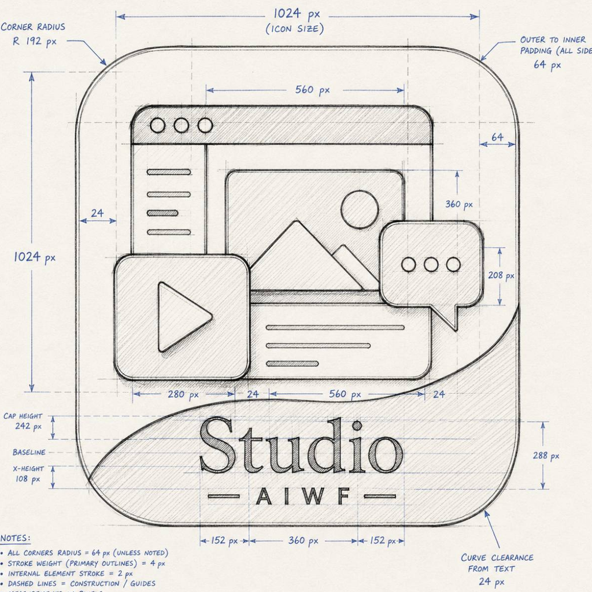
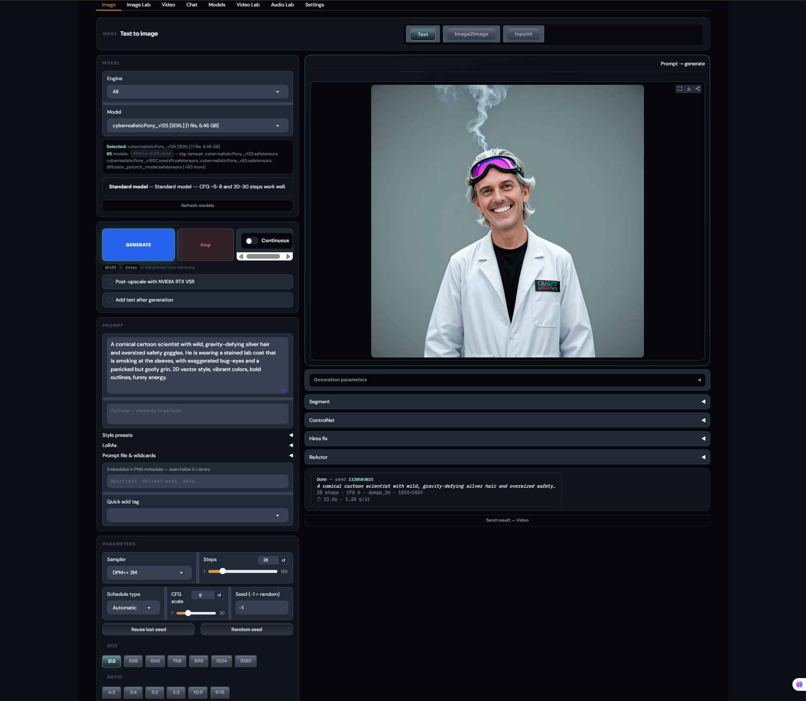

<h1 align="center">AIWF Studio</h1>

<p align="center">
  <strong>Local-first creative AI workspace for Windows and NVIDIA GPUs.</strong>
</p>

<p align="center">
  <a href="https://www.aiembeddedsystems.com">AI Embedded Systems</a> |
  <a href="#quick-start">Quick Start</a> |
  <a href="#what-works-on-main">What Works</a> |
  <a href="docs/FEATURES.md">Feature Inventory</a>
</p>

<p align="center">
  <a href="#quick-start"></a>
  <a href="https://www.python.org/"></a>
  <a href="frontend/"></a>
  <a href="frontend/"></a>
  <a href="frontend/"></a>
  <a href="#what-works-on-main"></a>
  <a href="#aiwf-studio-gradio-lab"></a>
  <a href="#image-generation"></a>
  <a href="LICENSE"></a>
  <a href="https://docs.nvidia.com/maxine/vfx/index.html"></a>
  <a href="https://www.aiembeddedsystems.com"></a>
</p>

AIWF Studio is focused on image generation, inpainting, video generation, and video-audio post-processing on local Windows/NVIDIA hardware. It is engineered by [AI Embedded Systems](https://www.aiembeddedsystems.com).

AIWF Studio is a clean-room rebuild of the AUTOMATIC1111-style Stable Diffusion web UI. The goal is a local creative workstation with explicit wiring, typed requests, predictable model folders, and no legacy global `shared` state.

This `main` branch is the stable sharing branch. It only advertises features intended for normal local use. Experimental work lives on `dev`.

- Full feature inventory: [`docs/FEATURES.md`](docs/FEATURES.md)
- LoRA pipeline direction: [`docs/LORA_PIPELINE_STRATEGY.md`](docs/LORA_PIPELINE_STRATEGY.md)

## Start Here

New users should start with **AIWF Studio Pro**. It is the cleaner React app and the steadier path for normal local use. Use **AIWF Studio Gradio Lab** for the broader beta workspace where pipeline experiments land first.

Both app tracks read and write the same model folders, output history, and settings. Switching between them is safe.

### AIWF Studio Pro

<p align="center">
  
</p>

**Stable UI track.** Create and generate, Workflow builder, Model Families, Models, Data, Monitor, Logs, and Settings, plus additional workspace screens in active integration.

```bat
AIWF Studio Pro.bat
```

```powershell
python launch_pro.py
```

Early testers should keep [`docs/TESTER_USER_GUIDE.md`](docs/TESTER_USER_GUIDE.md) open. It covers install options, hidden terminals, support-terminal access, recovery buttons, and error reports.

<p align="center">
  
</p>

### AIWF Studio Gradio Lab

<p align="center">
  
</p>

**Beta workspace.** Best for image, inpaint, ControlNet, enhance, segment, Sana Video, Wan/LTX video, and post-processing tests.

```bat
AIWF Studio Gradio Lab.bat
```

```powershell
python launch_gradio.py
```

<p align="center">
  
</p>

## Release Focus

Current focus: image generation, inpainting, video generation, and video-audio post-processing must be reliable before the project takes on more feature work.

- New user-facing features are paused until those paths pass local smoke tests.
- Optimization work is allowed when it improves an existing path and has a fallback.
- Benchmark claims need timing receipts from this repo, not upstream marketing numbers.
- Optional engines, model weights, SDKs, and generated outputs stay local and are not committed.

## Release State

`main` is a Pro-first local install: FastAPI + React/Vite starts from a clean install, serves the built frontend, and drives image/video generation plus the Pro bootstrap, runtime, capabilities, settings, logs, and data APIs.

Recent additions on `main`:

- **Workflow builder (Pro):** a **Send to workflow** button on the generation panel captures the current settings as a node; nodes are **manually reorderable by drag or up/down arrows**, with duplicate/remove/clear and local persistence. Uses a shared Pro/Gradio workflow-node serialization contract.
- **Additional Pro workspace screens:** Workflow, Model Families (live support matrix), Foundry (image surface), Pipeline (workflow blocks), Projects, Assistant, and Audio are wired alongside the stable Create flow. These screens are additive; the core Create -> generate path is unchanged. Maturity varies by screen.
- **User extensions:** drop a folder with a `plugin.py` into `plugins/` to add REST routes (`/api/ext/<id>/`), Gradio tabs, or event hooks. Managed in Settings; see [`docs/EXTENSIONS.md`](docs/EXTENSIONS.md) and the `plugins/hello-extension/` template.
- **Video Lab (Pro):** upload a video, then NVIDIA VSR upscale, RIFE interpolation, extend it via Wan image-to-video, or add audio. NVIDIA VSR is also wired for single images.
- **Pipeline routing fixes:** SDXL refiner is kept out of the base-model picker, Flux Fill is inpaint-only, unsupported files (e.g. Hunyuan) are excluded from the pickers instead of misclassified, and Windows Z-Image GGUF is blocked with a clear reason instead of hanging.
- **Adjustable runtime:** advanced Wan/LTX precision, offload, and SageAttention behavior are user-settable in Settings, with the shipped defaults as the tested baseline.
- **Installer:** Express install provisions Python 3.10 through uv, or a **conda fallback** if uv is unavailable; it offers to install Miniconda and builds the 3.10 venv automatically. It then installs CUDA PyTorch and requirements, adds the default SD 1.5 fp16 model, builds the Pro frontend, and creates Desktop shortcuts.
- **Validated env:** `torch 2.6.0+cu124`, CUDA 12.4, `diffusers 0.38.0`, `transformers 4.57.6`, `fastapi 0.139.0`.
- **Known gap:** the NVIDIA VideoFX SDK is optional and user-installed; VSR stays disabled until the SDK is present.

## Quick Start

On Windows, use the installer:

```bat
Install AIWF Studio.bat
```

Choose **Express**. It checks or installs Git, uv, Python 3.10, and Node.js LTS; prepares the AIWF runtime; builds the Pro frontend; and creates Desktop shortcuts for Pro and Gradio Lab.

Manual launchers:

```bat
AIWF Studio Pro.bat
AIWF Studio Gradio Lab.bat
```

Python entry points:

```powershell
python launch_pro.py
python launch_gradio.py
```

Older compatibility entry points still work:

```powershell
python launch.py        # Gradio Studio
webui.bat               # Gradio Studio
python webui_pro.py     # Pro API/React app, build frontend/ first
```

Optional local speed/settings logging:

```powershell
python launch.py --genlog
```

`--genlog` writes JSONL entries to `outputs/genlog/generation-log.jsonl` for SD, SDXL, and Wan runs. It records timings, runtime route/pipeline, settings, models, and LoRAs, but not prompt text. The flag is off by default.

## Runtime Folders

AIWF Studio creates and uses these local runtime folders:

```text
models/
outputs/
prompts/
wildcards/
workflows/
```

Common model locations:

```text
models/Stable-diffusion/   checkpoints
models/Loras/              LoRAs
models/VAE/                VAEs
models/ControlNet/         ControlNet models
models/sam/                SAM weights
models/wan/GGUF/           Wan high/low GGUF transformers
models/wan/Diffusers/      Wan shared components
models/flux/GGUF/          Flux GGUF transformers
models/flux/UNet/          Flux safetensors transformers
models/flux/Textencoder/   Flux CLIP-L and T5-XXL encoders
models/flux/VAE/           Flux ae.safetensors VAE
models/ltx/checkpoints/    LTX 2.3 checkpoints
models/ltx/upscalers/      LTX 2.3 spatial upscalers
models/ltx/text_encoder/   LTX 2.3 Gemma text encoder snapshot
models/insightface/        ReActor inswapper ONNX models
models/reactor/faces/      saved ReActor face models
```

No hard links or junctions are required. To reuse an existing A1111, ComfyUI, or shared model library, open **Settings -> Model paths** and add the folders as extra scan roots. Optional SDK/app paths, such as NVIDIA VideoFX executables, live under **Settings -> Engines & pipelines -> External tool paths**.

## What Works On Main

This table is the quick truth source for model-family support on `main`.

| Area | Works now | Not ready yet |
| --- | --- | --- |
| SD 1.5 | txt2img, img2img, inpaint, ControlNet, hires fix, face restore/upscale post-process, clip skip, VAE choice, PNG Info, LoRA through Diffusers adapters | Full A1111 extension parity |
| SDXL | txt2img, img2img, inpaint, ControlNet, hires/refiner path, VAE safety settings, face restore/upscale post-process, LoRA through Diffusers adapters | Treating the SDXL refiner as a standalone base model is blocked |
| SD3.5 | local Diffusers-folder checkpoints and basic generation route | Broad ControlNet, LoRA, and A1111-style extension parity |
| Flux | split local model folders from `models/flux/GGUF/` or `models/flux/UNet/`, local CLIP-L/T5/AE components, txt2img, Flux Fill as the inpaint-only route | Flux LoRA, Flux ControlNet, generic Flux img2img, and selecting Flux Fill as txt2img are blocked |
| Flux.2 Klein | local quantized/split-model routing and prompt-encoder handling work is present | Runtime speed and memory still need more receipts across 4B and 9B assets |
| Z-Image / Z-Turbo | safetensors or Diffusers-style routes are the target path; prompt encoder BNB loading is wired when available | Z-Turbo is not optimized yet. Z-Image GGUF is blocked on Windows because the fused GGUF CUDA kernels are Linux-only |
| Qwen Image | image-family routing and local asset discovery are present | Needs more smoke receipts before it should be advertised as release-ready |
| Sana image | local generation path has been tested during Pro work | Performance and settings need more receipts before strong speed claims |
| Image quant formats | FP16/BF16 safetensors, FP8 where the family loader supports it, BNB/NF4 where a route explicitly supports it, GGUF for supported Flux/Wan-style routes | FP4/NVFP4 is not a normal runtime path on this RTX 40-series target. Treat it as storage or conversion research unless a family-specific loader says otherwise |
| Wan video | image-to-video with 5B safetensors, 14B FP8/safetensors, and matched high/low GGUF pairs; VAE/component checks; runtime filtering; optional RIFE, ReActor, VSR, and audio post steps | Mixed 5B/14B/GGUF routes, unpaired high/low models, and unverified resident/streamed offload modes are blocked |
| LTX video | optional isolated LTX 2.3 worker, LTX 2B Diffusers smoke path, FP8 checkpoint handling, Gemma text encoder conversion tooling | Native Gemma GGUF hidden-state backend and NVFP4 runtime execution are not ready |
| Sana video | Experimental Pro and Gradio routes, text-to-video, image-to-video, quantization choices, VAE tiling choice, and text-encoder offload toggle | Treat as experimental until more receipts cover model loading, memory, and output quality |
| Audio/video-audio | Audio tab, optional MMAudio engine, generated-audio muxing after video | MMAudio checkpoints are non-commercial; broader audio workstation features are WIP |
| LLM/chat | model inventory, dataset/config builders, Ollama client tests, and hidden/gated chat workspace scaffolding | No promoted Pro chat worker yet. LLM chat is intentionally outside this Pro release. llama.cpp/GGUF chat serving is a future lane |
| Training | Kohya, ED2, and LLM training scaffolds are isolated and opt-in | Training is hidden/gated and must not be auto-started |

Coming soon, hidden from the v1 app: Anima split-file generation and Qwen Image Nunchaku. Their files may still be sorted and tracked locally, but the v1 UI does not list them for download or generation until their native loaders have passing smoke receipts.

### Image Generation

- txt2img, img2img, and inpaint
- Stable Diffusion 1.5, SDXL, SD3.5, and Flux txt2img checkpoint loading through Diffusers
- sampler, scheduler, steps, CFG, seed, size, VAE, clip skip, and hires fix controls
- live preview, interrupt, continuous generation, and job history
- prompt styles, wildcards, prompt files, dynamic prompt syntax, and Compel support
- LoRA selection, keyword expansion, saved aliases/strengths, and runtime adapter loading for supported Diffusers image families
- PNG metadata and PNG Info import back into the Image tab

### UI And Monitoring

- FastAPI + React/TypeScript/Vite Pro app with left-rail navigation
- Create, Workflow, Model Families, Models, Data, Monitor, Logs, and Settings workspaces, plus additional integrated screens (Foundry, Pipeline, Projects, Assistant, Audio)
- Workflow builder: **Send to workflow** from the generation panel, then manually reorder nodes by drag or up/down arrows (persists locally)
- User extensions loaded from `plugins/` with REST/tab/event hooks, managed in Settings
- scroll-safe panels, popup tool windows, and resizable workspace columns
- runtime monitor for backend state, queue health, logs, resources, and recent receipts
- browser-side Transformers.js prompt helper loaded only when **Analyze prompt** is clicked
- Pro API endpoints for runtime, bootstrap, generation, data, logs, settings, workflows, and extensions

### Inpaint, Masking, And Segment

- inpaint image/mask editor flow
- keep-original / last-result source handling
- SAM-assisted mask presets when SAM models are installed locally
- outpaint canvas expansion
- SAM mask generation when SAM weights are installed
- text-guided boxes through GroundingDINO when the optional dependency is available

### ControlNet

- single ControlNet unit in the Pro Create panel for image and inpaint routes
- local ControlNet model selection
- built-in lightweight preprocessors where available

### Models And LoRA

- local checkpoint, LoRA, VAE, ControlNet, SAM, and enhancement model scanning
- SD3.5 Diffusers-folder checkpoints are supported in `models/Stable-diffusion/`
- Flux split-model txt2img is supported from `models/flux/GGUF/` or `models/flux/UNet/` with local CLIP-L, T5-XXL, and `ae.safetensors`
- model aliases and trigger-word helpers
- curated download entries for common local model folders, with direct buttons only for public non-auth entries
- CivitAI browse links for model families AIWF can route; downloaded-model and installable-model browsers are coming soon
- import helpers for model folders from another local install
- SD/SDXL/SD3.5-style runtime LoRA loading through Diffusers adapter APIs
- Wan stage LoRAs for supported 5B and high/low transformer routes, with runtime-aware filtering
- Flux/new transformer-image LoRA and ONNX LoRA are intentionally blocked until their pipeline-specific appliers are implemented and tested

### Enhance And VSR

- Pro quick post-process for current preview or uploaded image: face restore, image upscale, restore plus upscale, and NVIDIA VSR image upscale
- Gradio Lab full Enhance tab for image upscale, face restore, old-photo restore, and restore/upscale pipelines
- GFPGAN / CodeFormer-style restoration when models are installed
- old-photo restore pipeline
- tiled upscale controls for local VRAM limits

### Image Lab

- maturity matrix tracking each image route against the AUTOMATIC1111 parity baseline: [`docs/IMAGE_MATURITY_MATRIX.md`](docs/IMAGE_MATURITY_MATRIX.md)
- XYZ plot runner, batch img2img/inpaint runner, and loopback runner
- native `GET /api/v1/image/maturity` endpoint

### Video

- Wan image-to-video through three explicit local routes: 5B safetensors, 14B FP8/safetensors, or matched GGUF High Noise + Low Noise transformer pairs
- experimental Sana Video text/image-to-video tab
- optional LTX 2.3 text/image-to-video through an isolated worker engine
- optional RIFE post-processing to write 30 FPS or 60 FPS output after generation
- optional ReActor post-processing from the first key frame, an uploaded image, or a saved face model
- optional NVIDIA RTX VSR / Video Effects SDK upscale post-processing when the SDK is installed
- optional generated audio muxing after video when a supported local audio backend is installed
- optional video-conditioned audio post-processing through MMAudio, installed in an isolated engine venv
- Pro Video Lab: upload an existing video, then VSR upscale, RIFE interpolation, extend it via Wan image-to-video (continues from the last frame), or add audio
- standalone RIFE frame interpolation tab for existing videos
- standalone Audio tab for generating music or sound effects after a video
- local Wan component folder support for tokenizer, text encoder, scheduler, and VAE
- conservative route selection so users cannot mix 5B, 14B FP8/safetensors, and GGUF settings by accident

Wan optimization work is still active. FP8, resident high/low mode, streamed block offload, SageAttention, and similar accelerator paths must stay benchmark-gated.

The near-term audio path is VAP: video audio post-processing. AIWF generates or accepts a video first, then an optional local audio backend creates audio and muxes it back into the MP4.

The first video-conditioned backend is MMAudio. It is isolated under:

```text
engines/audio/
```

Bootstrap script:

```powershell
scripts/bootstrap_mmaudio.ps1
```

MMAudio is optional and soft-fails when not installed so the visual video output is preserved.

Important license note: MMAudio code is MIT licensed, but the released checkpoints are CC-BY-NC 4.0, so this route should be treated as non-commercial unless you have separate permission.

## Remote Access

Use Tailscale when possible. If you launch with network listening enabled, add authentication before using AIWF outside a trusted local network.

## Project Shape

- `main` is the stable runtime branch for users.
- `dev` keeps broader experiments and active research work.
- `frontend/` is the React/TypeScript/Vite source for the Pro UI; build it with `npm install && npm run build` to populate `frontend/dist`, which `webui_pro.py` serves.
- `docs/`, `tests/`, and `scripts/` are part of the public maintainability story.
- runtime data such as models, outputs, local configs, and agent notes are ignored.

Useful project docs:

- `docs/ARCHITECTURE.md`
- `CONTRIBUTING.md`
- `docs/ATTRIBUTION.md`
- `docs/DEPENDENCY_POLICY.md`
- `docs/ENGINE_ISOLATION.md`
- `docs/FEATURES.md`
- `docs/IMAGE_MATURITY_MATRIX.md`
- `docs/MAINTAINER_NOTES.md`
- `docs/PATH_CONFIGURATION.md`
- `docs/qa/README.md`

## License And Third-party Status

This is a practical release checklist, not legal advice.

- AIWF Studio's own code is licensed under the **MIT License** in `LICENSE`.
- The MIT license allows use, copying, modification, distribution, sublicensing, and sale of the software, as long as the copyright and license notice stay with the code.
- Model weights, generated outputs, NVIDIA SDK binaries, MMAudio checkout files, and large engine repos are local-only and ignored by git.
- Users are responsible for the licenses of checkpoints, LoRAs, VAEs, ControlNet models, SAM weights, Wan files, and audio models they install.
- Stable Diffusion 3.5 model weights are released under Stability AI's Community License and may require Hugging Face gate acceptance before download.
- NVIDIA Video Effects / VFX SDK support is optional. AIWF does not vendor or redistribute NVIDIA SDK binaries or models.
- MMAudio checkpoints are CC-BY-NC 4.0. Do not present MMAudio-backed audio as commercial-safe without separate permission.
- InsightFace code is MIT, but InsightFace-trained models and the inswapper face-swap model require separate license care for non-local or commercial use. Face swapping must only be used with consent and applicable-law compliance.
- Segment Anything is Apache-2.0; AIWF's segment/inpaint path is clean-room integration, with attribution kept in `docs/ATTRIBUTION.md`.

Keep optional restricted components clearly marked as local/user-installed.

## Attention Acceleration

AIWF uses PyTorch SDPA as the stable attention baseline. Wan video now prefers Diffusers' per-module SAGE backend when SageAttention 2.2 is installed and callable, then falls back to AIWF's SageAttention SDPA patch, then plain Torch SDPA.

Current rule for `main`: keep SageAttention optional and benchmark-gated. Wan must still run when SageAttention is missing, and any speed claim needs matched local receipts. Flash-attn and xFormers are optional experiment lanes, not default requirements for the RTX 4070 Ti SUPER setup.

## WIP And Help Wanted

These areas exist as work-in-progress or need more hardware coverage before they should be treated as stable:

- deeper integration of the newer Pro workspace screens (Foundry, Pipeline, Projects, Assistant, Audio), wired and rendering, still maturing
- Wan FP8 high/low video speed path
- Wan resident / streamed offload modes
- training engines (Chat and Training tabs are hidden by default in Studio/Modern)
- Ollama or llama.cpp chat workspace after the Pro image/video release is stable
- model conversion and quantization tools
- richer generated-audio controls and model installers
- AMD, Intel, Linux, and lower-VRAM validation
- installer first-run onboarding polish

## Credits

AIWF Studio is clean-room code. It draws from established local AI tooling around Stable Diffusion, Diffusers, ControlNet, Segment Anything, GroundingDINO, Real-ESRGAN, GFPGAN, CodeFormer, Wan, ComfyUI-GGUF, and the AUTOMATIC1111 web UI.

Optional video post-processing can use NVIDIA Video Effects / VFX SDK components for RTX VSR-style upscale, cleanup, AI green screen, and relighting when the user installs the NVIDIA SDK locally. See `docs/ATTRIBUTION.md` for third-party credits and source links.

## Contributing

AIWF Studio needs focused help from people who work on local creative AI, Windows/NVIDIA workflows, Python services, frontend rebuilds, model runtime tooling, and install flows for normal PC users. Open an issue with a narrow repro or send a PR that includes the check you ran.
