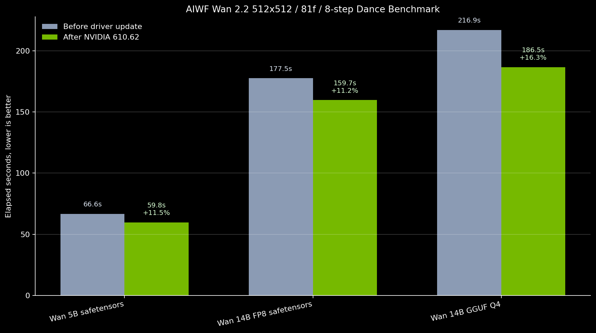
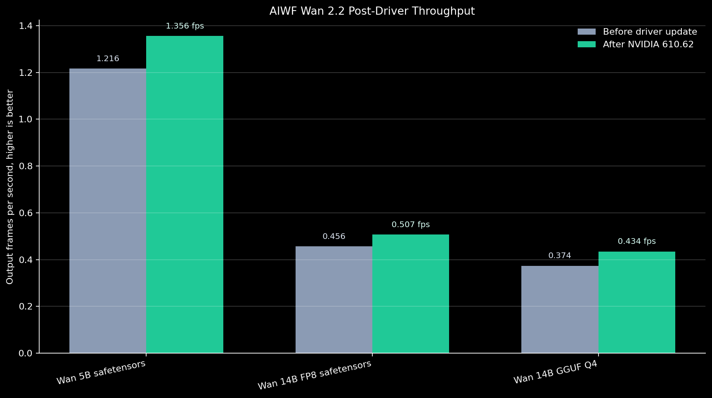
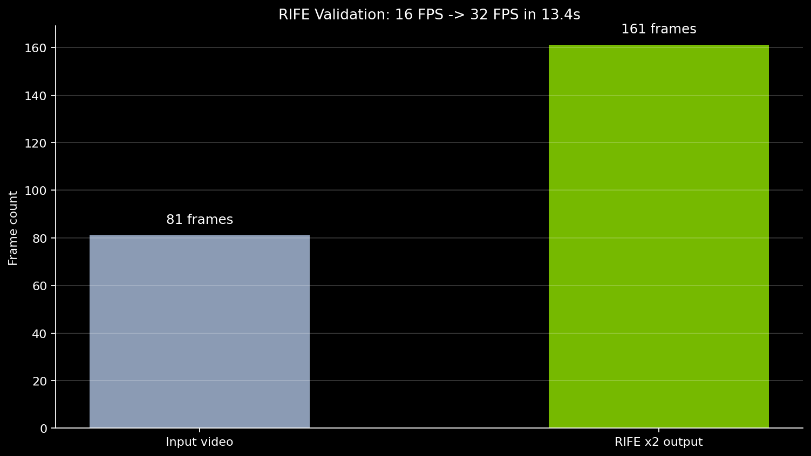

# Wan Post-Driver Benchmark - June 20, 2026

Fresh local benchmark after updating to NVIDIA Studio Driver `610.62` on an RTX 4070 Ti SUPER 16GB.

Settings were held constant against the previous Wan dance receipts:

- Source image: local woman reference image
- Prompt: simple dance prompt
- Size: `512x512` request, Wan aspect resize output `416x576` or `432x576`
- Frames: `81`
- Steps: `8` total (`4 high + 4 low` for dual-stage routes)
- Sampler: Euler
- Wan attention: SageAttention active

## Elapsed Time

## Throughput

## Results

| Route | Before | After `610.62` | Change | Speedup |
| --- | ---: | ---: | ---: | ---: |
| Wan 5B safetensors | `66.594s` | `59.750s` | `-6.844s` | `+11.45%` |
| Wan 14B FP8 safetensors | `177.489s` | `159.650s` | `-17.839s` | `+11.17%` |
| Wan 14B GGUF Q4 | `216.867s` | `186.470s` | `-30.397s` | `+16.30%` |

## RIFE Check

RIFE was run against the new 5B output using `rife47.pth`, `x2`, fast mode, no ensemble.

Result: `81 -> 161` frames, `16 FPS -> 32 FPS`, wall time `13.443s`.

## Raw Receipts

- CSV summary: [`wan-post-driver-20260620.csv`](wan-post-driver-20260620.csv)
- Local run summary: `outputs/benchmarks/wan_routes_dance_512_81f_8step_post_driver_20260620_233938/summary.json`

Generated video outputs stay local under `outputs/` and are not committed.
