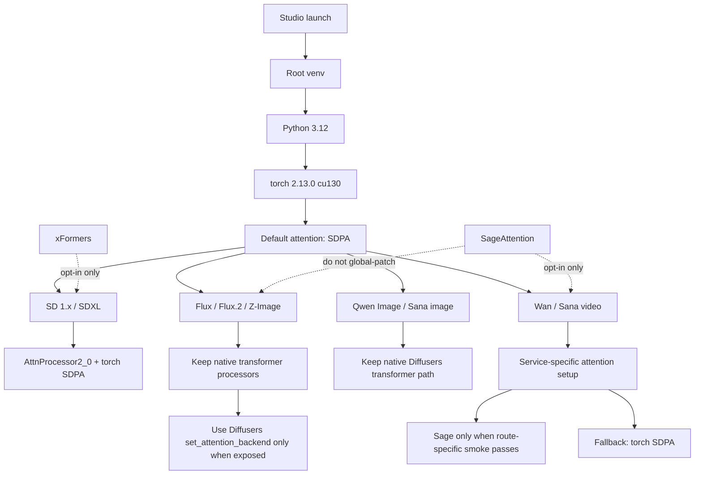

# CUDA 13 Runtime Attention Experiment

This note keeps the routing picture in the repo. The venv setup, package logs, benchmark receipts, and image outputs live in the local experiment folder and research receipt from the July 2026 pass.

- Local experiment folder: `F:\AIWF_Studio_attention_opt_bench_20260708-134009`
- Research receipt: `research runs/20260708-134009-cuda13-sageattention-xformers-aiwf-bench`
- Main Studio choice after the pass: Python 3.12, PyTorch 2.13.0+cu130, torchvision 0.28.0+cu130, Diffusers 0.39.0, SDPA default.

Keep this rule simple: SDPA is the default image runtime. SageAttention and xFormers need a route-specific receipt before they become a default for any family.
