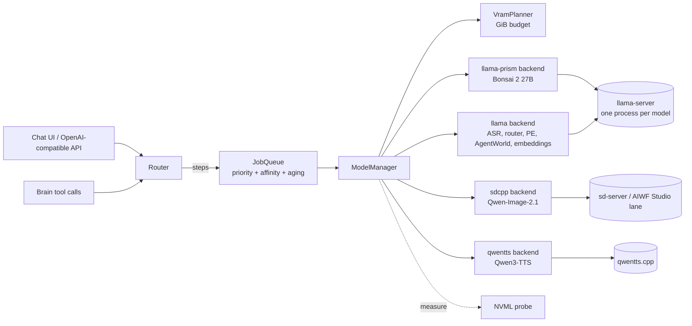

# Simple AI Chat: Architecture

The harness lets one brain model (Ternary Bonsai 2 27B) do the thinking. A
scheduler brings specialist Qwen models in and out of a 16 GB GPU on demand.
For the model research behind these choices, see [RESEARCH.md](RESEARCH.md).

## Goals

- **One chat window, many abilities:** chat, reasoning and code; vision;
  image generation and editing; voice in and out; audio understanding;
  environment simulation; and RAG memory.
- **Never OOM silently, never thrash.** Every load is planned in GiB against
  a measured budget.
- **Every enhancer is a visible toggle.** That includes MTP, prompt
  enhancers, moderation, thinking depth and cloud fallback.
- **Windows first.** Runs on an RTX 4070 Ti SUPER (16 GB), 40 GB RAM and an
  i5-13th gen, and also works on Linux.

## Non-goals (for now)

- Multi-user serving or batching. This is single-user, `--parallel 1`.
- Training. AIWF Studio's `engines/llm` already covers QLoRA.
- Re-implementing image pipelines that AIWF Studio already ships.

---

## Component map



| Module | Status | Responsibility |
|---|---|---|
| `registry.py` | ✅ phase 0 | Loads `config/models.yaml` and `config/hardware.yaml`, validates them, estimates VRAM, finds the best provider for a capability |
| `vram.py` | ✅ phase 0 | Pure planner: what to evict so model X fits |
| `jobs.py` | ✅ phase 0 | Thread-safe priority queue with model affinity and aging |
| `manager.py` | ✅ phase 0 | Executes plans through backends; tracks resident and busy models; pinned restore; KV save/restore; NVML calibration |
| `router.py` | ✅ phase 0 | Request → capability steps (attachments, slash commands, toggles); tool name → model |
| `backends/llama_server.py` | ✅ command builder, ⚠️ process control untested on GPU | One llama-server process per model, file logs, `/health` wait, `/slots` save/restore |
| `backends/fake.py` | ✅ | Dry-run backend for tests and `python -m simple_ai_chat simulate` |
| `gpu.py` | ✅ | Optional NVML probe (`pip install .[gpu]`) |
| API server, UI, tool loop, sd.cpp/TTS backends | 🔜 phases 1–4 | See the roadmap in RESEARCH.md §10 |

---

## Request lifecycle

1. **Route.** `Router.plan(request)` returns ordered `Step`s.
   - An audio attachment adds `asr` first.
   - `/image` adds `prompt_enhance` (if toggled) and then `image_gen`.
   - An image attachment routes to `vision`, which is also served by the brain.
   - Everything else goes to `chat` with a profile (`chat`, `code`, `research`, `game` or `fast`).
2. **Queue.** Each step becomes a `Job(model_id, priority)`. Steps of one request run inside `manager.hold_restore()`, so a chain like *prompt enhancer → image model* does not reload the brain in between.
3. **Schedule.** `manager.next_runnable(queue)` walks jobs best-first and returns the first whose plan is runnable. Jobs blocked by a busy model wait without stalling the rest of the queue.
4. **Run.** `with manager.using(model_id):` plans, evicts, loads and marks the model busy. On exit, a `transient` model is unloaded and any evicted `pinned` model (the brain) is restored with its KV slot.
5. **Tools.** When the brain emits a tool call, `Router.model_for_tool(name)` names the model, and the call becomes another job. Planned tools: `generate_image`, `edit_image`, `speak`, `transcribe`, `simulate_environment`, `simulate_web_page`, `analyze_audio`, `memory_search`, `rerank`, `moderate`, plus MCP tools.

---

## Model manager in detail

### Residency classes

| Class | Meaning | Examples |
|---|---|---|
| `pinned` | Loaded at startup. Evicted only as a last resort, then restored (KV saved first) | Bonsai 2 27B |
| `warm` | Stays while there is room; LRU + priority eviction | ASR, TTS, router |
| `transient` | Unloaded as soon as its job ends | Qwen-Image-2.1, prompt enhancers, AgentWorld |
| `cpu` | Never counted against VRAM | Embeddings, reranker, Qwen3Guard |

`exclusive: true` (Qwen-Image-2.1, the mainline Qwen3.8 A/B brain) evicts
every idle GPU model, even if the weights would fit. Diffusion activations need
the headroom.

### Planning algorithm (`VramPlanner.plan`)

```
budget = gpu_total - reserved(WDDM/desktop) - safety_margin        # 14.5 GiB
need   = measured[x]  or  weights + mmproj + kv(ctx, kv_type) + overhead

if x resident              -> NOOP
if x is CPU                -> LOAD (no eviction)
if need > budget           -> IMPOSSIBLE (lower ctx / quantize KV / smaller quant)
if fits and not exclusive  -> LOAD
candidates = idle residents sorted by (is_pinned, priority, last_used)
evict until fits (exclusive: evict all candidates)
still short or (exclusive and anything busy) -> WAIT
pinned victims -> restore_after
```

Busy models are never evicted. The planner is pure: it touches no processes,
which makes it exhaustively unit-testable.

### Queue scoring (`JobQueue`)

```
score = priority + aging_per_sec * seconds_waiting + affinity_bonus * (model already resident)
```

The defaults (`aging 1.0/s`, `affinity 25`) mean five queued TTS chunks run
back-to-back while TTS is loaded. An image job that has waited about 25 s
still beats them.

### Calibration

When an NVML probe is wired in, the manager records `used_after - used_before`
around each load. It then plans with that *measured* number from then on, and
logs any estimate that is off by more than 0.5 GiB. This matters for the
estimate-only rows in `models.yaml`.

### KV save and restore around evictions

Before evicting a pinned model, the manager calls the backend's `save_state`,
which for llama-server is `POST /slots/0?action=save` with `--slot-save-path`.
After the restore it calls `restore_state`. If restore fails, the
conversation just re-prefills (an estimated ~800–1,500 tok/s for Bonsai on
this card, scaled from the RTX 4090 numbers). The fork's support for saving Gated-DeltaNet recurrent state still
needs to be verified on the real card.

### Failure handling

- **Backend load failure:** raises `LoadError`. Evicted pinned models stay in `pending_restore` and come back on the next `restore_pinned()`.
- **Diagnostics:** each llama-server writes to `logs/<model-id>.log`. If a process exits early, the last 2 KB of its log go into the error.
- **Silent spill:** disable *CUDA Sysmem Fallback* in the NVIDIA Control Panel. A spill then becomes a hard failure the planner can see.

---

## Backends

| Backend key | Binary | Models | Notes |
|---|---|---|---|
| `llama-prism` | PrismML fork `llama-server` (prism-b10709+, CUDA 12.4 on Windows) | Bonsai 2 27B | Only runtime for PTQ1_0/PQ2_0 |
| `llama` | Mainline `llama-server` | Router, ASR, PE, AgentWorld, WebWorld, embeddings, reranker, guard, Qwen3.8 MTP A/B | One process per model. Router mode is not used: it budgets by model count and has a load race |
| `sdcpp` | `sd-server` / AIWF Studio sd.cpp lane | Qwen-Image-2.1 | Phase 4. Offload text encoder after conditioning |
| `qwentts` | `qwentts.cpp` (or the `qwen-tts` Python package) | Qwen3-TTS CustomVoice / VoiceDesign / Base | Phase 3. Streaming audio |
| `transformers` | Isolated venv worker (AIWF worker protocol) | Fallbacks without GGUF | |
| `cloud` | Qwen Cloud (OpenAI-compatible) | Qwen3.8-Max, Omni-Flash, LiveTranslate | Off unless `cloud_fallback` is toggled on |

`launch:` keys in `models.yaml` map 1:1 to llama-server flags
(`snake_case` → `--kebab-case`). Flags that differ between llama.cpp builds
therefore live in config, not code. Check them with
`python -m simple_ai_chat command <model-id>`.

---

## Brain conventions (Bonsai 2 quirks the harness must absorb)

- **System message:** merge all system prompts into **one leading system message**.
- **Effort:** map UI effort *low/medium/high/max* to `medium` / `medium` / `xhigh` / `xhigh`. Bonsai rejects `"high"`, and `low` behaves like `xhigh`.
- **Thinking budget:** send it as a top-level request field, never inside `chat_template_kwargs`. Thinking off = `reasoning_effort: "none"` with the server at `--reasoning auto`.
- **Output limit:** keep `max_tokens` ≥ 16384 when thinking is on.
- **Tool loops:** don't echo reasoning back, send `"{}"` for empty arguments, validate every call against its JSON schema, and on a malformed call retry once at `medium` effort with the validation error.
- **Sampling:** send `min_p 0.05`, `presence_penalty` and `repetition_penalty` explicitly. The GGUF metadata lacks them.

---

## Toggles and profiles

Both are defined in `config/models.yaml` (`toggles:`, `profiles:`) and will be
editable from the UI. The router already honors `prompt_enhancer`,
`speak_replies` and `moderation`. The rest are applied by the request builder
in phase 1.

---

## Planned external API (phase 1+)

| Endpoint | Purpose |
|---|---|
| `POST /v1/chat/completions` | OpenAI-compatible front door (streaming), so Open WebUI, Qwen Code or other clients can use the harness |
| `POST /v1/audio/transcriptions`, `POST /v1/audio/speech` | Voice |
| `POST /v1/images/generations`, `/v1/images/edits` | Image |
| `GET /admin/vram` | `ModelManager.snapshot()`, for the UI's VRAM bar |
| `GET/POST /admin/queue` | Queue view and cancellation |
| `GET/POST /admin/models` | Load, unload, enable and pin |

## AIWF Studio integration

- **Image tool:** use AIWF Studio's sd.cpp lane and Qwen image editor as the image backend instead of duplicating them.
- **Shared GPU:** take a cross-process GPU lease (lock file or localhost endpoint) before exclusive jobs. AIWF's `GpuTenantLock` is in-process only.
- **Shared models (optional):** point `paths.models_dir` at the AIWF `models/` tree.

## Testing

- **Unit tests:** `python -m pytest` in `simple-ai-chat/` runs the planner, queue, manager (with `FakeBackend`), router and command-builder tests. No GPU is needed.
- **Dry runs:** `python -m simple_ai_chat simulate <ids | a+b chains>` replays a job sequence against the real config.
- **On the GPU (phase 1 exit criteria):** `llama-bench` receipts per model, NVML-measured footprints written back to `models.yaml`, and verified `/slots` save/restore on the Prism fork.
